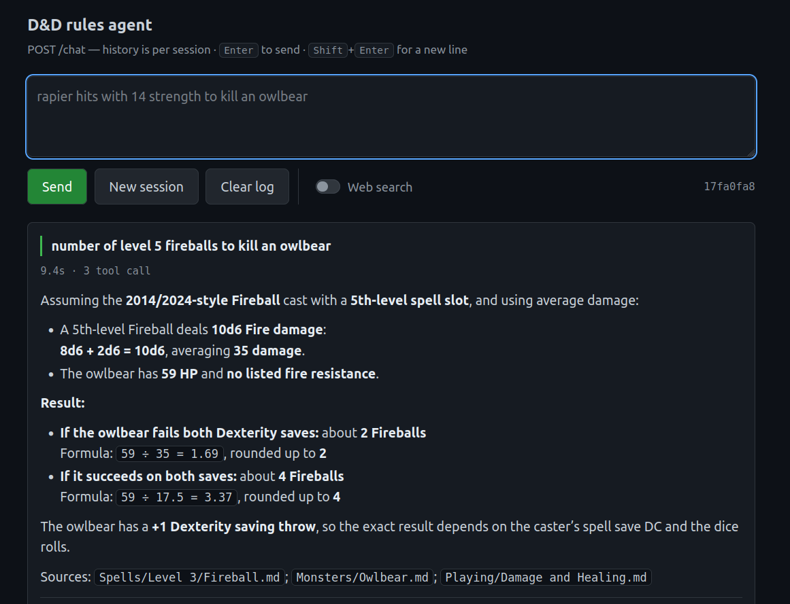
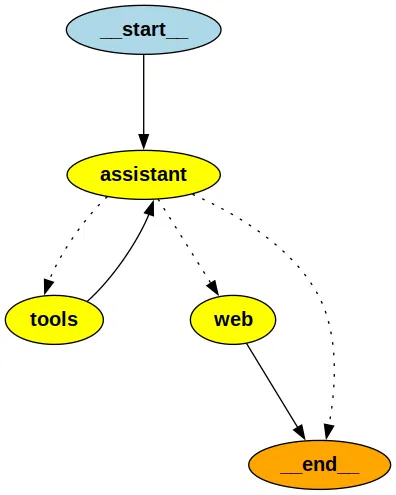
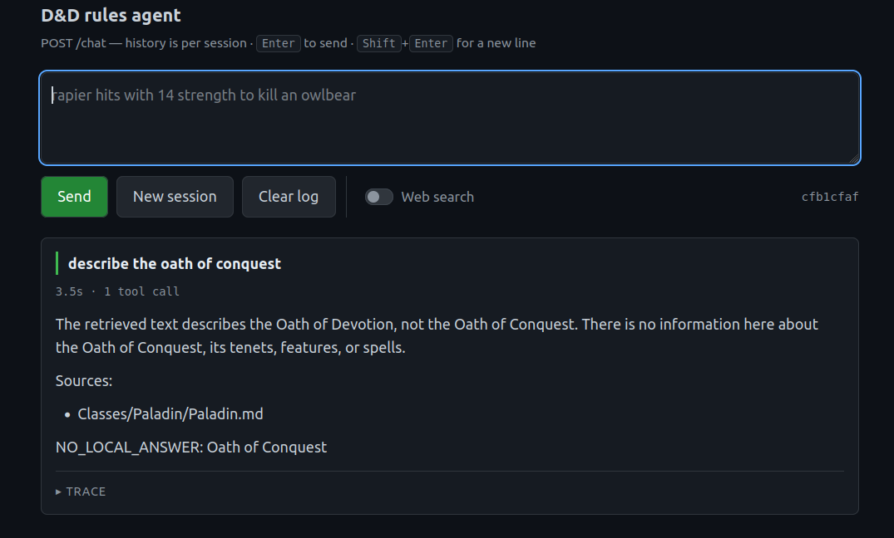
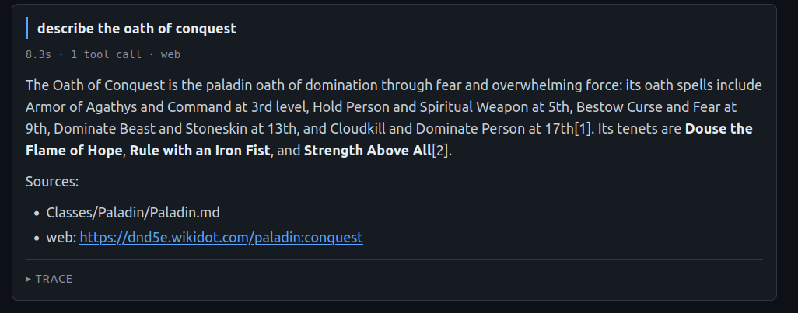

# D&D Rules Assistant

This is a RAG chatbot to help with the D&D 5e rules.     
It uses rules retrieved from local files, with a web fallback if needed.



## Where is the data? Where do the rules come from?
The rules come from the D&D System Reference Document v5.2.1, published under [Creative Commons Attribution 4.0 International License \("CC-BY-4.0"\)](https://creativecommons.org/licenses/by/4.0/).    
To avoid parsing the PDF files (you can try to do it with Docling, PyMuPDFLoader, or alternatives), I suggest downloading the parsed files from
[this repo](https://github.com/your5e/5e-srd-markdown/tree/main/dnd/521/markdown).     
You can do this simply running `./download_data.sh`, that will put the md files in the *markdown* folder.

## Requirements
- Docker + Docker Compose
- An [OpenRouter](https://openrouter.ai) API key

## How to run it
1. Copy the *.env.example* file in *.env* and set your keys.
2. Download the data: ```./download_data.sh``` 
3. Populate chroma: ```docker compose --profile populate up```
4. Run the chatbot: ```docker compose --profile chat up ```
5. Enjoy [here](http://localhost:8080)

The first 3 steps need to be run only once.      
The third step may require ~10 minutes to complete.

## Some metrics

| factual_correctness (f1) | faithfulness | semantic_similarity | ctx_precision | ctx_recall | numeric | sentinel | avg_calls | no_call | avg_secs |
|---|---|---|---|---|---|---|---|---|---|
| **0.726** | **0.957** | **0.916** | 0.302 | **0.916** | **0.971** | **1.000** | 1.71 | 0 | 5.9 |

Using google/gemma-4-31b-it as model and openai/gpt-5.6-luna as a judge in RAGAS. More details [here](evaluation/).

## Software architecture
The system is composed of 3 modules:    
- [populate_chroma](src/populate_chroma/): adds the markdown files into chroma (*data* folder)    
- [MCP](src/MCP/): mcp server exposing a tool to request data from chroma     
- [RAG](src/RAG/): server that exposes POST method to perform requests to the chatbot

### populate_chroma
This is a fairly simple script that parses all the contents of the markdown folder (DirectoryLoader on all the .md files).           
I used RecursiveCharacterTextSplitter, it is faster than a SemanticChunker, and it is probably better anyways on markdown files. I am using Parent-child chunking to use the child for the embedding, while passing the parent to the LLM.      
You can try to change the chunk_size, or even remove the parent splitter, if you want to reduce the tokens used when the LLM receives the context from chroma.

### MCP
FastMCP server that exposes the tool retrieve_rules over http.    
This tool wraps a hybrid search, combining BM25 with the Chroma vector store. The env BM25_WEIGHT sets the proportion to use. Setting it to 0, will result in using only chroma.                 
Do I *really* need a MCP server for a single tool, that could have been hardcoded in the RAG project? Maybe not, but I think it is cleaner in this way.

### RAG
The actual heart of the chatbot, a LangGraph application that uses LLM from OpenRouter and the tool exposed by the MCP server.       
Here is the architecture:    
       
The *assistant* node is the LLM, invoking once (or multiple times) the tools in the ToolNode.       
The *web* node is a fallback: if the last line of the assistant answer contains "NO_LOCAL_ANSWER: \<something\>" and if the web_search flag is active on the dashboard, then *web* node tries to answer.       
The dashboard (index.html) is kindly offered by Claude.

## Example on web search
Asking something that is not in the local files without the Web search:       
      
And with the Web search:      


## Possible TODOs
#### Improving web fallback
The web fallback exploits web models from OpenRouter, another solution could be to use manually Tavily or Exa.
#### Deterministic gap detection for web fallback
"NO_LOCAL_ANSWER" depends on the LLM formatting the answer correctly, which is not always reliable and depends on the model used. Other solutions should be explored.
#### Persistence
At the moment, the chatbot uses InMemorySaver. An alternative could be to use AsyncSqliteSaver or AsyncPostgresSaver to store the conversation in an external db, making the history resilient to reboots of the container.
#### Migrating from chroma to pgvector
It would be nice to have a *real* db running on another container. Anyways, at the moment it is probably not needed for an application meant to run only on my pc, with a peak of 1 user. Also, my pc would scream if I run a pgvector container on it.
#### Response caching
It *could* be useful to cache some responses. Maybe not the LLM ones, but some MCP queries may overlap. Again, it is just for the sake of it, and has no real utility in a local application with 1 user. MCP queries are also free, since I am running the embedding locally, so there are no tokens to save. Also, my pc would scream if I run a redis container on it.
#### Token optimization
With more than 1 user, it could be needed to reduce the chunk size or the number of chunks retrieved by chroma, in order to save token cost.

## Attribution

This project does not redistribute any SRD content. `download_data.sh`
fetches it at setup time from [your5e/5e-srd-markdown](https://github.com/your5e/5e-srd-markdown).

The content you download is the System Reference Document 5.2.1 ("SRD 5.2.1")
by Wizards of the Coast LLC, available at https://www.dndbeyond.com/srd,
licensed under the Creative Commons Attribution 4.0 International License
(https://creativecommons.org/licenses/by/4.0/legalcode).

If you redistribute this project **with** the downloaded content, you must
include the attribution statement above.

The code in this repository is licensed under [MIT](LICENSE).
